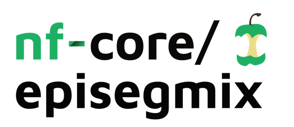
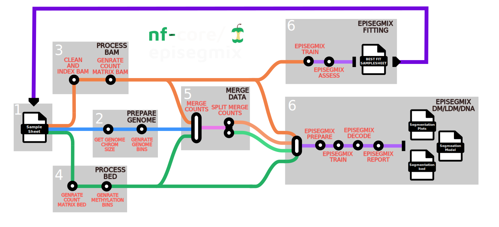

<h1>
  <picture>
    <source media="(prefers-color-scheme: dark)" srcset="docs/images/nf-core-episegmix_logo_dark.png">
    
  </picture>
</h1>

[](https://github.com/codespaces/new/nf-core/episegmix)
[](https://github.com/nf-core/episegmix/actions/workflows/nf-test.yml)
[](https://github.com/nf-core/episegmix/actions/workflows/linting.yml)[](https://nf-co.re/episegmix/results)[](https://doi.org/10.5281/zenodo.XXXXXXX)
[](https://www.nf-test.com)

[](https://www.nextflow.io/)
[](https://github.com/nf-core/tools/releases/tag/3.5.2)
[](https://docs.conda.io/en/latest/)
[](https://www.docker.com/)
[](https://sylabs.io/docs/)
[](https://cloud.seqera.io/launch?pipeline=https://github.com/nf-core/episegmix)

[](https://nfcore.slack.com/channels/episegmix)[](https://bsky.app/profile/nf-co.re)[](https://mstdn.science/@nf_core)[](https://www.youtube.com/c/nf-core)

## Introduction

**nf-core/episegmix** is a bioinformatics pipeline for chromatin segmentation. It uses a hidden Markov model (HMM) to annotate genomic regions with functional states (e.g., enhancers, promoters) based on combinations of epigenetic modifications, capturing spatial relations via transition probabilities.




## Default Workflow: Standard Mode

By default, the EPISEGMIX pipeline executes the **Standard Mode** (utilized when `--episegmix_mode` is set to `standard` or remains unspecified, and `--merge` is `false`). This primary pathway processes histone data (BAM files) to generate segmentation models, bypassing methylation processing.

### Execution Steps

1. **Genome Preparation** (`PREPARE_GENOME` & `GENERATE_BINS`): Fetches chromosome size files and generates the required genomic bins.

2. **Processing Branching (Histone & Methylation)**: Parses the input samplesheet and evaluates the `--merge` flag:
    * **Histone Processing** (`PROCESS_HISTONES`): Maps BAM files against genomic bins to extract count matrices. 
    * **Methylation Processing** (`PROCESS_METHYL`): Triggered if `--merge true`. Processes BED files at base-pair resolution with merged +/- strands to maintain signal fidelity.

3. **Count Merging & Synchronization** (`MERGE_DATA`): If `--merge` is enabled, the pipeline intersects the processed matrices. This synchronizes the Histone (binned) and Methylation (base-pair) data into a consistent windowed format to ensure all multi-omic layers are aligned to the same coordinate system.

4. **Segmentation Modeling**: Based on the selected `--episegmix_mode` (`standard`, `duration`, or `dna`), the data is routed through a specific modeling subworkflow:
    * **Standard** (`MODEL_TRAINING_STD`): Default HMM-based segmentation.
    * **Duration-Aware** (`MODEL_TRAINING_DM`): Incorporates state duration modeling.
    * **DNA-Centric** (`MODEL_TRAINING_DNA`): Optimized for DNA-specific features.
    * *Note: Each subworkflow executes four consecutive modules: `prepare`, `train`, `decode`, and `report`.*

5. **Distribution Fitting & Automated Selection** (`DISTRIBUTION_FITTING`): If the `fitting` mode is triggered, the pipeline identifies the optimal statistical distribution for the data using:
    * `episegmix_distfit_histone_train`: Trains models across statistical distributions.
    * `episegmix_distfit_histone_assess`: Evaluates and selects the distribution with the best fit.
    * **Automated Step**: If the `--best_fit_segmentation` flag is present, the pipeline automatically executes the segmentation workflow (Step 4). By default, this runs in `standard` mode unless `--duration` is explicitly specified.

---

### **Subworkflow Reference**
The pipeline logic is organized into the following modular components:

| Category | Subworkflows |
| :--- | :--- |
| **Setup** | `PREPARE_GENOME`, `GENERATE_BINS` |
| **Data Processing** | `PROCESS_HISTONES`, `PROCESS_METHYL`, `MERGE_DATA` |
| **Modeling Modes** | `MODEL_TRAINING_STD`, `MODEL_TRAINING_DM`, `MODEL_TRAINING_DNA` |
| **Optimization** | `DISTRIBUTION_FITTING` |

---

> **Note:** You can set the execution mode using the primary `--episegmix_mode` flag (e.g., `standard`, `duration`, `dna`, or `fitting`) or by using direct shortcut flags: `--standard`, `--duration`, `--dna`, or `--fitting`.


## Usage

> [!NOTE]
> If you are new to Nextflow and nf-core, please refer to [this page](https://nf-co.re/docs/usage/installation) on how to set-up Nextflow. Make sure to [test your setup](https://nf-co.re/docs/usage/introduction#how-to-run-a-pipeline) with `-profile test` before running the workflow on actual data.

First, prepare a samplesheet with your input data that looks as follows:

***samplesheet.csv***:

```csv
sample_id,replicate,epigenetic_mark,file_name,modality,paired_end,distribution
Kidney,1,H3K27ac,../data/kideny/histone/kideny_H3K27ac.bam,ChIP-seq,true,NBI
Kidney,2,WGBS,../data/kideny/wgbs/kideny_WGBS.bam,ChIP-seq,true,BI
```

Each row represents a specific assay file associated with a sample. The pipeline automatically distinguishes between histone data and methylation data based on the file extension.

### Column Specifications

* **`sample_id`**: A unique identifier for your sample (e.g., `Kidney`). Files sharing the same `sample_id` will be grouped and processed together.
* **`replicate`**: The replicate number for the sample (e.g., `1`).
* **`epigenetic_mark`**: The specific target or assay type (e.g., `H3K27ac` for histones, `WGBS` for methylation).
* **`file_name`**: The file path. Histone data must be `.bam` or `.bam.gz`. Methylation data must be `.bed` or `.bed.gz`.
* **`modality`**: The type of experiment performed (e.g., `ChIP-seq`, `WGBS`).
* **`paired_end`**: A boolean value (`true` or `false`) indicating if the sequencing data is paired-end.
* **`distribution`**: The statistical distribution to apply during model training for this mark (e.g., `NBI` for Negative Binomial, `BI` for Binomial).

Now, you can run the pipeline using:

```bash
nextflow run nf-core/episegmix \
   --input <SAMPLESHEET> \
   --outdir <OUTDIR> \
   --episegmix_mode standard \
   --genome hg38 \
   -profile <docker/singularity/.../institute> 

```

> [!WARNING]
> Please provide pipeline parameters via the CLI or Nextflow `-params-file` option. Custom config files including those provided by the `-c` Nextflow option can be used to provide any configuration _**except for parameters**_; see [docs](https://nf-co.re/docs/usage/getting_started/configuration#custom-configuration-files).

For more details and further functionality, please refer to the [usage documentation](https://nf-co.re/episegmix/usage) and the [parameter documentation](https://nf-co.re/episegmix/parameters).

## Pipeline output

To see the results of an example test run with a full size dataset refer to the [results](https://nf-co.re/episegmix/results) tab on the nf-core website pipeline page.
For more details about the output files and reports, please refer to the
[output documentation](https://nf-co.re/episegmix/output).

## Credits

EpiSegMix tool was devloped and designed by:
- [Nihit Aggarwal](nihit.aggarwal@uni-saarland.de/)
- [Johanna Elena Schmitz]
- [Dr. AbdulRahman Salhab]
- [Prof. Dr. Jörn Walter]
- [Prof. Dr. Sven Rahmann]


nf-core/episegmix was originally written by [Aaryan Jaitly](https://github.com/aaryanjaitly)

## Contributions and Support

If you would like to contribute to this pipeline, please see the [contributing guidelines](.github/CONTRIBUTING.md).

For further information or help, don't hesitate to get in touch on the [Slack `#episegmix` channel](https://nfcore.slack.com/channels/episegmix) (you can join with [this invite](https://nf-co.re/join/slack)).

## Citations

<!-- TODO nf-core: Add citation for pipeline after first release. Uncomment lines below and update Zenodo doi and badge at the top of this file. -->
<!-- If you use nf-core/episegmix for your analysis, please cite it using the following doi: [10.5281/zenodo.XXXXXX](https://doi.org/10.5281/zenodo.XXXXXX) -->


An extensive list of references for the tools used by the pipeline can be found in the [`CITATIONS.md`](CITATIONS.md) file.

You can cite the `nf-core` publication as follows:

> **The nf-core framework for community-curated bioinformatics pipelines.**
>
> Philip Ewels, Alexander Peltzer, Sven Fillinger, Harshil Patel, Johannes Alneberg, Andreas Wilm, Maxime Ulysse Garcia, Paolo Di Tommaso & Sven Nahnsen.
>
> _Nat Biotechnol._ 2020 Feb 13. doi: [10.1038/s41587-020-0439-x](https://dx.doi.org/10.1038/s41587-020-0439-x)
